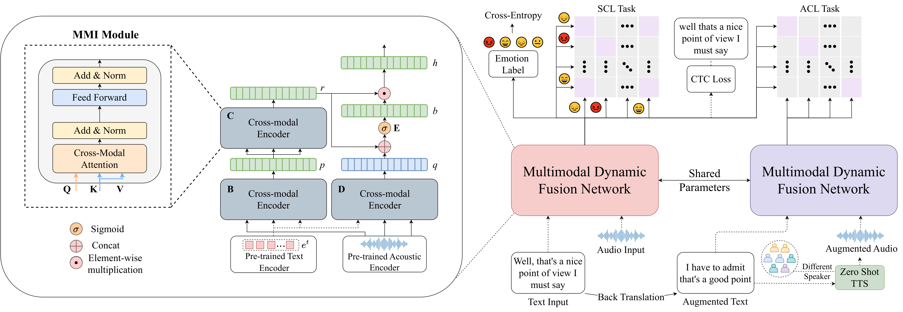

# MMER

This repository contains code for our InterSpeech 2023 paper - [MMER: Multimodal Multi-task Learning for Speech Emotion Recognition](https://arxiv.org/abs/2203.16794)  

### Proposed MMER Architecture:  

  

Tu run our model, please download and prepare data as suggested below:  
* download the [roberta embeddings](https://drive.google.com/file/d/1xy1Ht2-qb0LwCz50o-y--Nln00d5TOQc/view?usp=sharing) and unzip them in the **data/roberta** folder.  
* download the [roberta embeddings for augmentations](https://drive.google.com/file/d/1KxILCQr7od7pfwdfpJp3VVwZHf0iQczm/view?usp=sharing) and unzip them in the `data/roberta_aug` folder.  
* download the [iemocap dataset](https://sail.usc.edu/iemocap/iemocap_release.htm) and put the tar file in the `data` folder. Then prepare and extract IEMOCAP audio files in `data/iemocap` using instructions in data_prep folder.  
* download [iemocap augmented files](https://drive.google.com/file/d/1xy1Ht2-qb0LwCz50o-y--Nln00d5TOQc/view?usp=sharing) and put them in the `data/iemocap_aug` folder.  


To run MMER, please execute:  
```
sh run.sh path_to_audio_files
```

You can change the hyper-parameters in `run.sh` according to your needs. Some useful ones are listed below:    
```
 --alpha : weight for CTC loss in the final loss  
```

If you find this work useful, please do cite our paper:  
```
@inproceedings{ghosh22b_interspeech,
  author={Sreyan Ghosh and Utkarsh Tyagi and S Ramaneswaran and Harshvardhan Srivastava and Dinesh Manocha},
  title={{MMER: Multimodal Multi-task Learning for Speech Emotion Recognition}},
  year=2023,
  booktitle={Proc. Interspeech 2023},
}
```
